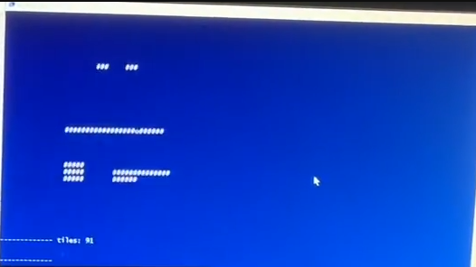

# teeworlds-headless-clients
A curated list of teeworlds and ddnet clients without graphics.

The list is sorted with the best being at the top.

| name | language | protocol support | based on | description |
| --- | --- | --- | --- | --- |
|  [term-ux](https://github.com/chillerbot/chillerbot-ux) | C++/rust | 0.6 and ddnet | [ddnet](https://github.com/ddnet/ddnet) | Compile with ``-DCURSES_CLIENT=ON -DHEADLESS_CLIENT=ON`` then it is a fully interactive ncurses client (linux only). 
|  [teeworlds-client](https://gitlab.com/swarfey/teeworlds-client) | TypeScript | 0.6 and ddnet | - | Library to connect a bot to a Teeworlds server. Moddable client and library. Protocol reimplementation from scratch in TypeScript.
|  [tw-chatonly](https://github.com/headshot2017/tw-chatonly) (headshot2017) | C++ | 0.6 and incomplete ddnet | - | A minimal DDNet 9.3.1 client in a command-line. Small in code size. Compiles in under one second.
|  [teeworlds_network](https://github.com/ChillerDragon/teeworlds_network) | Ruby | 0.7 | - | A teeworlds 0.7 network protocol library written in Ruby. Protocol reimplementation from scratch in Ruby.
|  [ddnet](https://github.com/ddnet/ddnet) | C++/rust | 0.6 and ddnet | [teeworlds](github.com/teeworlds/teeworlds) | Compile with ``-DHEADLESS_CLIENT=ON`` to get a ddnet client without graphics
|  [teeworlds](https://github.com/teeworlds/teeworlds) | C++ | 0.7 | - | Compile with ``-DHEADLESS_CLIENT=ON`` to get a teeworlds client without graphics
|  [chillerbot-ng](https://github.com/chillerbot/chillerbot-ng) | C++ | 0.6 and ddnet | [ddnet](github.com/ddnet/ddnet) | An interactive client for chatting and stress testing servers. Developed for windows. 
|  [twchatonly](https://github.com/nobody-mb/twchatonly) (nobody-mb) | C++ | 0.6 and incomplete ddnet | - | Single c++ file
|  [chillerbot-bw](https://github.com/chillerbot/chillerbot-bw) | C++ | 0.6 old ddnet | [ddnet](github.com/ddnet/ddnet) | Teeworlds 0.6 client without graphics based on ddnet. It still uses bam instead of cmake as build system. Developed for windows.
|  [chillerbot-cb](https://github.com/chillerbot/chillerbot-cb) | C++ | 0.6 | [TW-Console-Client](https://github.com/Stitch626/TW-Console-Client) | A project by Stitch626 from 2016 with life support patches from ChillerDragon in 2019. Uses bam to compile and is not maintained.
|  [chillerbot-h7](https://github.com/chillerbot/chillerbot-h7) | C++ | 0.7 | [teeworlds](https://github.com/teeworlds/teeworlds) | Vanilla teeworlds 0.7 client with graphics ripped out. Use original teeworlds with ``-DHEADLESS_CLIENT=ON`` instead.
